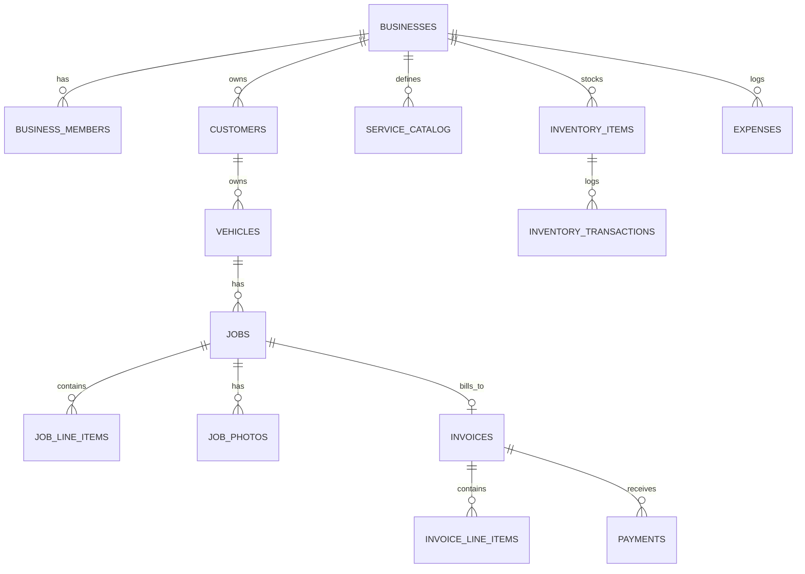

# BusinessOS — Product Requirements Document (V1)
### "Run Your Business From Your Phone."

| | |
|---|---|
| **Status** | Draft for engineering kickoff |
| **Owner** | Founder (garage vertical) |
| **First test market** | One real garage — 1–10 vehicles/day |
| **Prepared** | August 2026 |
| **Cost mandate** | ₹0 infrastructure cost until the product proves itself; scale only when a real, measured limit is hit |
| **Revision** | v1.3 — v1.1 closed four build-blocking gaps: no backup in Phase 0, no media-size discipline, hand-wavy invoice numbering, no data-privacy treatment (see §3, §6.13, §11, §15.1). v1.2 closed the testing/deployment gap (§20) and fixed five section cross-references. v1.3 re-verifies every free-tier number in §3 against live pricing as of August 2, 2026 — all confirmed accurate, none needed correction |

> **A note before the plan:** the original brief asks for 25,000+ words. That instinct — "more detail = safer build" — is worth challenging directly, because it's the first weak idea in the brief. A PRD's job is to remove ambiguity per decision, not to maximize word count. Padding a document to hit a number produces more text for engineers to disagree over, not less. What follows is deliberately dense: every section is something an engineer would otherwise have to ping you to ask about. Nothing is here to hit a target length.

---

## 1. Executive Summary

BusinessOS replaces the notebook, the WhatsApp chat thread, and the calculator that a small garage owner currently uses to run their shop, with one phone-first system: customers, vehicles, job cards, inventory, billing, and cash — updated once, reflected everywhere.

The strategic bet that makes this fundable on a founder's budget is the **architecture**, not just the product: build and validate on infrastructure that costs nothing, and only spend money once a specific, named limit is actually hit. This document specifies a three-phase path — **static offline app → free-tier multi-tenant cloud → paid scale-out** — with the exact numeric triggers for moving between phases, so "when do we spend money" is never a judgment call made under pressure.

The MVP vertical is **garages** (your father's shop is the design partner and the acceptance test). Every other vertical in the long-term vision (salons, retail, clinics) is explicitly deferred until the garage workflow is proven, because building six verticals before proving one is the second weak idea in the brief — addressed in §4 and §19.

---

## 2. Vision, Mission, Product Philosophy

**Vision.** Not billing software, not accounting software — a Business Operating System. One core engine (customers, catalog, inventory, jobs, money, reports) that different business types skin with their own vocabulary and workflow.

**Mission.** Enter information once. Everything downstream — stock, invoice, expense, dashboard, report — updates automatically without a second manual entry.

**Product philosophy — three non-negotiable constraints:**

1. **As simple as WhatsApp, not another ERP.** If the owner needs a training session, the design has failed. Every core action (new bill, mark vehicle ready, add expense) should be reachable in ≤3 taps from the home screen.
2. **Mobile-first, Android-first, offline-first.** Desktop is a future nice-to-have, not a design constraint on V1.
3. **Free until proven, paid only when it must be.** Every technology choice below is chosen because it has a real, usable free tier today (verified August 2026, sources cited) — not because it's popular.

---

## 3. The Core Strategic Decision: A Zero-Cost-to-Scale Architecture

This is the section that answers your actual question, so it comes before personas and user stories — everything else in the document assumes this plan.

### Phase 0 — "Prove the Workflow" (Weeks 0–6, cost: ₹0, one business only)

Build a single-page **HTML + vanilla JS/Alpine.js Progressive Web App (PWA)**. No backend at all. Data lives in the browser via **IndexedDB** (accessed through a small wrapper library like Dexie.js so you're not hand-rolling IndexedDB's clunky raw API). Installed to the home screen on your father's phone via "Add to Home Screen" — it *is* an app to him, with no Play Store review, no backend to operate, and no monthly bill.

- **Hosting:** GitHub Pages or **Cloudflare Pages** — both are permanently free for a static site, no credit card, no time limit.
- **Scope:** one business, one device install. No login, no multi-tenancy, no cloud sync yet. Job cards, service catalog, invoice PDF generation (client-side, e.g. with a small library like pdf-lib), Android Share Sheet for sending the PDF.
- **Non-negotiable addition — backup (this was missing from the first draft):** IndexedDB with no cloud behind it means a lost, stolen, or factory-reset phone destroys the *only* copy of a real business's data. Before this touches your father's actual customers, add one more feature: a **"Backup my data"** button in Settings that exports everything as a single JSON file, shared to the owner's own Google Drive/email via the same Android Share Sheet already being built for invoices. A few hours of work; it's the difference between a pilot and a real risk.
- **Why this order matters:** it tests whether the *workflow* survives real shop-floor chaos — grease on the screen, patchy 4G, a mechanic who doesn't want to type — before a single rupee or a single line of backend code is spent. Everything in Phase 1 is a rebuild of the data layer underneath the *same* UI, not a rewrite of the product.
- **Exit criterion:** the garage prefers this to the notebook for two consecutive weeks. If it doesn't, Phase 1 should not start — that's a product problem, not an infrastructure problem, and no architecture fixes it.

### Phase 1 — "Multi-Tenant Cloud, Still Free" (Months 2–6, cost: ₹0 for the first 50–150 businesses)

| Layer | Choice | Why | Free-tier ceiling (verified Aug 2026) |
|---|---|---|---|
| Database + Auth + Storage + Realtime + serverless functions | **Supabase** (hosted Postgres) | One vendor, real Postgres (no lock-in to a proprietary query language), Row Level Security gives per-tenant isolation for free | 500 MB database, 1 GB file storage, 50,000 monthly active users, 5 GB egress/month, 500,000 Edge Function calls/month, up to 2 active projects. Free projects **auto-pause after 7 days with zero API traffic** — mitigate with a scheduled free GitHub Actions ping every few days. |
| Frontend hosting | **Cloudflare Pages**, not Netlify | Netlify moved to a metered "credits" model in 2025–2026: the new free allowance is roughly **300 credits/month ≈ 15 GB bandwidth**, and once it's exhausted the site stops serving until next month. For an app serving vehicle/job **photos**, that ceiling arrives fast. Cloudflare Pages' free tier gives **unlimited bandwidth**, 500 builds/month, and native R2 object storage (10 GB free) for photos that bypasses egress limits entirely. | Practically unlimited for this use case at MVP scale |
| *(If you specifically want Netlify)* | Still fully workable | Same Git-push deploy workflow as Cloudflare Pages, same free static hosting model | Fine for a text/data-light MVP; revisit once photo volume grows — see migration trigger below |
| Offline sync | Hand-rolled: IndexedDB write queue + reconcile-on-reconnect | At garage scale (1–10 vehicles/day, one shop), a full sync engine is over-engineering; a simple "queue writes locally, replay to Supabase when online, use client-generated UUIDs to make replays idempotent" pattern is a few hundred lines of code | N/A — custom code, ₹0 |
| Auth | **Email/password or a 4–6 digit PIN tied to phone number as the login ID** — *not* SMS OTP | This is a direct, evidence-based pushback on the obvious choice. SMS-based phone OTP is never actually free at any real scale — Firebase, Supabase+Twilio, and every other provider bill per message once you're past a small daily testing allowance (roughly ₹1–₹35 per message depending on provider and country). For a garage owner logging in once and staying logged in for weeks, OTP is a recurring cost for a one-time convenience. PIN login costs nothing and is *more* usable for a shop floor (no waiting for SMS on patchy signal). | ₹0 |
| **Media handling (missing from first draft)** | Compress every photo client-side *before* it's written to the upload queue — resize to ≤1600px on the longest edge, JPEG quality ~70%, target under 300 KB/photo, using the browser's native Canvas API (no library needed) | Job-intake and job-completion photos are the fastest way to blow through the free tier. An uncompressed phone photo is routinely 3–6 MB; at even 10 photos/day across 100 businesses that exhausts 1 GB Storage in days, not months. Compressing at capture time is the single highest-leverage line item for keeping Phase 1 actually free | ~300 KB/photo → roughly 3,000+ photos before nearing the 1 GB Storage ceiling, instead of a few hundred |

**Why Postgres-with-Row-Level-Security instead of a database-per-tenant:** the brief's "no business can access another" requirement does **not** require separate databases per business — that would mean managing hundreds of databases, hundreds of migrations, and hundreds of backup jobs as you grow. A single shared Postgres database with a `business_id` column on every table, enforced by Postgres **Row Level Security policies** (§10), gives the same hard isolation guarantee with one schema, one migration, one free-tier project. This is the improvement the brief invites ("suggest better architecture whenever possible") — and it's the standard pattern for exactly this kind of multi-tenant SaaS.

**Free-tier verification note (checked August 2, 2026):** every ceiling in the table above was re-checked against live pricing pages, not carried forward from memory. Supabase's free tier is unchanged from what's specified: 500 MB database, 1 GB file storage, 5 GB egress, 50,000 MAU, 500,000 Edge Function invocations, 2 active projects, 7-day auto-pause. Cloudflare Pages' unlimited-bandwidth + 500-builds/month + 10 GB R2 free tier is also unchanged. Netlify raised its bandwidth credit rate on April 14, 2026 (20 credits/GB, up from 10) — which happens to make the "≈15 GB/month" estimate in this table *more* accurate today than when it was first written, not less. **This note has a shelf life.** Free tiers move a few times a year — recheck supabase.com/pricing and Cloudflare's pricing page before Phase 1 kickoff if more than ~2 months have passed since this date, since a rate change is exactly the kind of thing that shouldn't be discovered mid-build.

### Phase 2 — "Scale Out" (revenue-funded, triggered by a number — never by a vibe)

| Trigger (measured, not guessed) | Move to |
|---|---|
| Database consistently > 400 MB, or the 7-day auto-pause becomes operationally annoying, or you need daily backups / SLA | Supabase **Pro**, $25/month |
| Two workers editing the same job card concurrently causes visible conflicts, or you need true background sync (not just "sync when app is open") | Add **PowerSync** (or ElectricSQL) — a sync layer built specifically to bring offline-first, local-SQLite sync to a Supabase/Postgres backend, without you hand-rolling conflict resolution. Both have their own free starter tiers. |
| You need push notifications, background sync while the app is closed, or Play Store distribution matters for owner trust | Wrap the PWA in **Capacitor** (near-zero rewrite — reuses the existing HTML/JS) to ship a real Android app while keeping one codebase |
| PDF generation or monthly report generation starts blocking the UI or timing out on Edge Functions | Move that specific job to a background worker (Supabase Edge Function + `pg_cron`, or a small dedicated worker) |
| Photo/report read volume competes with transactional writes and dashboards feel slow | Put Cloudflare's CDN in front of Storage (already default if using R2); add a read replica if query load — not storage size — is the bottleneck |

**The point of this table:** nobody should ever "decide" to spend money on infrastructure. They should look at this table, see a row is true, and upgrade that one thing. Everything else stays exactly as it is.

---

## 4. Target Users & Scope Discipline

**Phase 1 vertical (only):** garages, bike workshops, small car service centers — 1–10 vehicles/day. This is the entire MVP scope.

**Deliberately deferred, and here's the pushback on doing it now:** the brief lists six long-term verticals (repair shops, chicken shops, salons, retail, hardware, clinics) as part of the "long-term target." Building generic support for all six before one is proven is how MVPs die — six shallow verticals with no depth in any of them, versus one deep vertical that a real customer (your father) actually keeps using. The correct sequencing:

1. Build the garage vertical completely (this document).
2. While doing so, keep the **core engine** (customers, service catalog, jobs, inventory, invoices, payments, expenses) named and modeled generically — which it already is in §11 — so that vertical #2 is a *skin* (different field labels, different job-card fields) on the same tables, not a new schema.
3. Choose vertical #2 based on actual referral demand from garage owners (§17), not a roadmap guess.

### 4.1 Multi-Vertical Extensibility — How Vertical #2 Actually Gets Built Without a Rewrite *(added)*

"Leave room to scale to other verticals" is a real requirement, but the wrong way to satisfy it is building salon/retail/clinic screens now — that's the six-verticals-before-one mistake in §4, just moved earlier. The right way is making sure **today's schema doesn't have to change shape** when vertical #2 arrives. Two small, cheap decisions now buy that, and everything else about the garage build stays exactly as already specified:

1. **`jobs.vehicle_id` is nullable, not required.** A garage job has a vehicle; a salon appointment or a clinic visit doesn't. Making this one column optional today means a future "job" can be just `customer_id` + `assigned_worker_id` + line items — no vehicle concept forced onto a business that has none. This costs nothing to build now (it's the difference between one word — `not null` — being present or absent in the `create table` statement) and is expensive to retrofit later, since by then real garage data depends on it always being set.
2. **A `custom_fields jsonb` column on `jobs` and `customers`.** Vertical-specific detail (a salon's "hair type / stylist notes," a clinic's "visit reason") lives here as free-form key-value data, not as new columns. No migration is required to onboard vertical #2 — only a new entry in a small config table (below) that tells the UI which keys to render as fields and what to label them.
3. **A `business_type_templates` config table** (full definition in §11, alongside the rest of the schema) — one row per vertical, driving labels/workflow, not code branches. V1 ships with exactly one row — this is config, not a feature to build:

```sql
insert into business_type_templates values (
  'garage',
  '{"vehicle": "Vehicle", "job": "Job Card", "worker": "Mechanic"}',
  '["pending","in_progress","completed","delivered","cancelled"]',
  '[{"name":"Car Wash","price":150},{"name":"Oil Change","price":400},{"name":"Brake Service","price":600}]'
);
```

**Worked proof this holds up — a salon, with zero schema changes:** onboarding inserts a `business_type_templates` row for `'salon'` with labels like `{"job": "Appointment", "worker": "Stylist"}` and no `"vehicle"` key at all; the Job Card screen simply doesn't render a vehicle picker when the template has no vehicle label; a salon job sets `vehicle_id = null` and puts `{"stylist_notes": "..."}` in `custom_fields`; billing, inventory, payments, expenses, dashboard, and reports run completely unchanged, because none of them ever referenced "vehicle" in the first place — only `jobs` and the UI layer needed to know about it. That's the whole exercise: two schema tweaks made once, now, while the garage schema is still being written — not a rewrite later.

### Personas

| Persona | Who | Core need | Device reality |
|---|---|---|---|
| **Owner** | Runs the garage, often not deeply "tech" | See money and jobs at a glance; never lose a customer's history | Android phone, one hand, often standing |
| **Worker / Mechanic** | Does the actual repair | Know what's assigned to them today; log status without touching money | Shared or personal Android phone, greasy hands, patchy connectivity |
| **Customer** | Indirect user | Gets a clear invoice, doesn't need an account | Receives a WhatsApp/SMS PDF, nothing installed |
| **Super Admin** | You / founding team | Keep the platform healthy across every business, without ever seeing inside one business's private data unless supporting them | Desktop, occasional |

---

## 5. Priority: MoSCoW for the MVP

| | Feature |
|---|---|
| **Must (V1 launch blockers)** | Business onboarding · Service catalog · Customer + vehicle records · Job cards with status · Inventory with auto-deduct · Invoice generation + PDF + Share Sheet · Cash/UPI/Card/Credit payment logging · Expense logging · Real-time dashboard · Basic reports (daily/monthly) · Worker role with restricted permissions · Offline mode for job cards & billing |
| **Should (V1.1, first 60 days post-launch)** | Audit log · Activity timeline · Notifications (in-app) · Purchase orders / ordered parts tracking · Referral program · Multi-language toggle |
| **Could (V2)** | Configurable granular worker permissions (V1 ships with two simple tiers instead — see §13) · Barcode scanning via phone camera (software-only, no hardware scanner) · Multi-location support for owners with 2+ garages |
| **Won't (explicitly out of scope, per the brief)** | AI, OCR, number-plate recognition, GST filing, payroll, marketplace, insurance, loans, WhatsApp Business API, automated payment-gateway reconciliation |

---

## 6. Functional Requirements by Module

Each module: **why it exists → flow → key rules → edge cases.** Database tables and API detail live in §11–12 to avoid repeating the schema three times.

### 6.1 Super Admin
*Why:* one dashboard to operate the whole platform without touching any business's data directly. *Flow:* login → platform dashboard → drill into a business only via an explicit "support mode" that is itself audit-logged. *Rules:* suspend/restore/activate/deactivate/delete a business; manage plans and feature flags per business or per plan; view platform-wide revenue and daily-active-business analytics. *Edge cases:* deleting a business is a soft-delete (status flag) for 30 days before hard delete, to allow accidental-delete recovery — the brief didn't specify this, and it should, because "Delete Business" with no recovery window is a support nightmare waiting to happen.

### 6.2 Business Onboarding
*Why:* first-run experience must take under 2 minutes or the owner abandons it. *Flow:* phone/PIN → business name, type, address, logo (optional), currency (default INR, configurable), language → seed a starter service catalog for the chosen business type (e.g., garage gets "Car Wash / Oil Change / Brake Service" pre-filled so the first bill takes 30 seconds, not "start from a blank list"). *Rules:* GSTIN field is captured even when GST is toggled off, so enabling GST later never requires a schema change or re-entry — this is a small addition to the brief worth making now, because retrofitting a required field onto existing invoices later is painful. *Edge cases:* owner starts creating a bill before finishing onboarding — allow it, backfill business settings later; never block billing on settings completeness.

### 6.3 Service Catalog
*Why:* turns billing into tapping quick-buttons instead of typing. *Flow:* setup screen to add/edit services (name, price, category, optional duration); during billing, a "+ Custom Service" option that asks **"Save to catalog? Yes/No"** exactly as specified in the brief — this is a good, simple pattern and is kept as-is. *Rules:* soft-delete services (never hard-delete, since historical invoices reference them). *Edge cases:* price changed after a job was created but before invoicing — the job's line item locks the price at time of creation; catalog price change never retroactively edits an open job.

### 6.4 Customers & Vehicles
*Why:* single source of truth for "who is this and what's their history," searchable the way a shop actually thinks (by phone, name, plate number, or invoice number). *Flow:* search-first UI (a garage owner searching "MH12AB1234" should get the vehicle and its full history in one tap) → customer profile shows vehicles, invoices, jobs, payments in one scroll. *Rules:* a vehicle belongs to exactly one customer at a time, but ownership can transfer (used-vehicle sale) without losing service history — transfer creates an audit trail entry, not a new vehicle record. *Edge cases:* same phone number used by two different customers (family sharing a phone) — allow multiple customer records per phone number; disambiguate by name at search time.

### 6.5 Job Cards (Garage Template)
*Why:* the operational heart of the product — replaces the paper job card taped to a windshield. *Flow:* new job → select/create vehicle → complaint (free text) → assign mechanic → status (Pending → In Progress → Completed → Delivered, plus Cancelled) → photos at intake and at completion → notes. *Rules:* status changes are timestamped and attributed (who, when) for the activity timeline; "Expected Delivery" drives an in-app notification to the owner when it's overdue. *Edge cases:* job reassigned to a different mechanic mid-repair — history keeps both mechanics' involvement rather than overwriting; vehicle intake with no phone signal — job card must be fully creatable offline, including photos (queued for upload).

### 6.6 Inventory
*Why:* replaces "I think we have three of these left" with an actual number, and replaces manual expense entry for parts purchases with an automatic one. *Flow:* two views — **Local Stock** (on-shelf) and **Ordered Parts** (in transit from supplier, with expected delivery date and received/not-received toggle). *Rules:* using a part in a bill **automatically decrements** stock; recording a purchase **automatically increments** stock **and automatically creates an expense record** — this automatic linkage (stock ↔ expense) is the single most valuable "enter once, updates everywhere" moment in the whole product, and the schema in §11 is built specifically to make this one atomic transaction, not two separate manual steps. *Edge cases:* selling more of a part than is in stock — allow it (a shop shouldn't be blocked from finishing a repair by software) but flag the resulting negative stock visibly on the dashboard rather than silently allowing it to look normal.

### 6.7 Billing, Invoicing & Sharing
*Why:* the moment of truth — this must feel faster than handwriting a receipt, or the whole product fails. *Flow:* new bill → pull in job's services/parts automatically (if billing from a job card) or start blank → add discount/tax (optional) → generate PDF (customizable logo, address, footer, signature, terms, brand color) → Android **Share Sheet** (not WhatsApp Business API — that requires business verification, per-conversation fees once past a small free tier, and an approval process a solo-founder pilot has no reason to take on; explicitly out of scope per the brief, see Appendix) → user picks WhatsApp/Telegram/Email/Drive/Nearby Share themselves. *Rules:* the invoice's real primary key is always a client-generated UUID, created the instant the bill is made — even offline, even with no `invoice_number` yet. The human-readable sequential number (`INV-0001`, `INV-0002`...) is assigned by the `create_invoice_from_job` Edge Function using a **per-business row-locked counter** (`invoice_counters`, see §11) the moment the invoice reaches the server, guaranteeing no gaps and no duplicates even if two workers bill simultaneously on two devices. *UI rule:* while an invoice is offline and unsynced, it displays as **"Invoice pending sync"** rather than a fabricated number — never show the owner a number that might later change, since a garage owner citing an invoice number to a customer needs it to be permanent from the moment they say it out loud. *Edge cases:* device stays offline for days (rare at 1–10 vehicles/day, but possible) — the PDF can still be generated and shared with a temporary reference (e.g. the date + a device tag) and is automatically reprinted with the final number once synced.

> **A zero-cost middle ground the brief doesn't mention:** the brief correctly rules out the paid WhatsApp Business API, but stops at "manual share." Consider also offering a pre-filled **`wa.me/<number>?text=...`** deep link as a one-tap option in the share flow — it opens WhatsApp with a message pre-typed (e.g., "Your vehicle is ready for pickup, invoice attached") ready to send. This costs nothing, requires no API approval, and closes the gap between "fully manual" and "fully automated" for reminders like "vehicle ready" or "payment pending."

### 6.8 Payments
*Why:* track what's actually been collected, distinct from what's invoiced. *Flow:* mark payment received against an invoice — Cash/UPI/Card/Credit, full or partial. *Rules:* an invoice can have multiple payment records (partial payments over time); "Credit" is a valid payment type meaning "owed, to be collected later" and feeds the Pending Payments dashboard metric. *Edge cases:* payment recorded, then invoice edited afterward — edits after any payment is recorded require owner confirmation and are captured in the audit log, since this is a place fraud/error most often hides.

### 6.9 Expenses
*Why:* completes the profit picture without a separate accounting tool. *Flow:* add expense (category, amount, paid to, date, optional receipt photo); inventory purchases create these automatically (§6.6). *Rules:* default categories seeded (Rent, Salary, Fuel, Electricity, Tea/Misc) plus unlimited custom categories. *Edge cases:* recurring expenses (rent, salary) — V1 requires manual monthly re-entry; a "repeat monthly" flag is a good V1.1 addition, not a V1 blocker.

### 6.10 Dashboard & Reports
*Why:* the single screen that has to answer "how's my business doing" in under 3 seconds of looking at it. *Flow:* real-time cards — Revenue, Expenses, Profit, Cash Received, UPI Received, Pending Payments, Vehicles Today, Jobs Pending, Low Stock, Top Mechanic, Most-Used Parts, Most-Profitable Service. Reports drill into Daily/Weekly/Monthly/Yearly views of the same metrics plus Customer Growth and Mechanic Performance. *Rules:* every number on this screen must update the instant an underlying transaction happens — this is exactly what Postgres real-time subscriptions (already included in Supabase's free tier) are for, rather than the owner having to pull-to-refresh. *Edge cases:* dashboard opened while offline — show last-synced data with a clear "offline, showing data as of [time]" indicator rather than a blank or broken screen.

### 6.11 Workers & Permissions
See §13 for the concrete role model — a deliberate simplification of the brief's fully-configurable-permissions request.

### 6.12 Notifications, Settings, Activity Timeline, Audit Log, Referral, Feature Flags
Specified in full in the original brief and largely correct as written; implementation detail (tables, triggers) is in §11. The one addition: audit log entries should be **append-only** (no update/delete permission at the database level, enforced by RLS) — an audit log that can itself be edited isn't an audit log.

### 6.13 Backup & Data Portability *(added — this was the biggest hole in the first draft)*
*Why:* the brief lists "Backup" as one line under Settings; it deserves to be a real requirement, not an afterthought, because it's the only thing standing between "phone breaks" and "business loses every customer record it has." *Flow:* Settings → Backup → **Export** produces a single JSON (Phase 0) or triggers a Supabase-side snapshot (Phase 1) that the owner can download or that runs automatically. *Rules:* Phase 0 export must work with zero connectivity, since Phase 0 has no cloud to fall back on at all. Phase 1 adds a **daily automatic export to Supabase Storage** as a second copy, independent of the free tier's "no automated backups" limitation on the database itself — cheap insurance against the exact gap the free tier leaves open. *Edge cases:* owner uninstalls and reinstalls the app (common when a phone is replaced) — the reinstall flow must offer "Restore from backup file" as a first-run option, not just "start fresh."

---

## 7. Non-Functional Requirements

| Category | Requirement | Rationale |
|---|---|---|
| Performance | Core actions (open app, create bill, mark job status) render in < 1s on a mid-range Android phone (~₹10,000 device, 3GB RAM) | This is the real device class in the target market — testing only on a flagship phone will hide problems |
| Availability | App itself must be fully usable with zero connectivity for job cards and billing; cloud sync is best-effort, not blocking | Garage floors have unreliable signal; the product must never say "can't create bill, no internet" |
| Data integrity | Every financial write (payment, invoice, stock deduction) must be atomic — a stock deduction and its linked expense either both happen or neither does | Prevents the exact kind of silent data drift a paper system never had |
| Localization | UI text externalized from day one, even if only English + Hindi/Telugu ship at launch | Retrofitting i18n after hardcoding strings is expensive; doing it from the start is nearly free |
| Accessibility | Minimum tap target 44×44px, high-contrast numerals for dashboard figures (a mechanic glancing at a screen with dirty hands/poor light) | Direct consequence of the actual use environment |
| Cost ceiling | Infrastructure spend is ₹0 until a named trigger in §3 is hit | The core strategic constraint of this document |
| **Device/browser floor *(added)*** | Minimum Android 8 / Chrome 90 for reliable IndexedDB + Service Worker support. Explicitly test on a Xiaomi/Realme/Vivo device with default settings, not just a Pixel/Samsung | These "aggressive battery saver" Android skins are extremely common in this market and are known to kill background service workers and silently drop queued syncs unless the app is explicitly whitelisted — a real device gap the brief didn't anticipate and generic testing on a flagship phone would miss entirely |

---

## 8. UX Principles & Navigation

- **Bottom navigation, 4–5 tabs max:** Home (dashboard) · Jobs · Bill · Inventory · More (customers, reports, settings folded here to avoid tab overload).
- **One-thumb operable:** primary actions (new bill, new job) live in a single floating action button reachable by thumb without regripping the phone.
- **No blank states without a next action:** every empty list ("no jobs today") shows the one button that would fix that.
- **Numbers before words:** the dashboard leads with figures, not paragraphs — an owner scans, doesn't read.
- **Undo over confirm-dialogs:** for low-risk actions (marking a job status), prefer a 5-second "Undo" toast over a blocking "Are you sure?" — for high-risk actions (deleting a bill, editing a paid invoice), keep the confirm dialog and log it.

---

## 9. Key Screens (MVP)

| Screen | Purpose | Key components | Notable states |
|---|---|---|---|
| **Home Dashboard** | At-a-glance business health | Revenue/expense/profit cards, jobs-pending count, low-stock alert banner | Offline-data banner; empty state on day 1 (no history yet) |
| **New Bill** | Fastest path from "car is ready" to "customer paid" | Customer/vehicle search-or-create, service quick-buttons, parts picker (pulls live stock), discount/tax fields, PDF preview, Share Sheet button | Draft auto-saved every few seconds so a dropped connection never loses a half-typed bill |
| **Customer/Vehicle Profile** | Full history in one scroll | Vehicle details, job history, invoice history, payment history | Search results ranked: exact plate match > exact phone match > name fuzzy match |
| **Job Card** | Live status of a repair | Status stepper, photo capture (intake/completion), parts used, mechanic assignment, notes | Camera permission denied → still allow job creation without photos, don't block |
| **Inventory** | Stock truth | Local Stock list with low-stock highlighting, Ordered Parts list with expected-delivery countdown | Negative-stock items visually flagged red |
| **Settings** | Business profile, invoice design, employees, language, plan | Sectioned list, each opening a focused sub-screen | — |

### Layout Wireframes for the Three Highest-Risk Screens *(added — no designer has drawn these yet, so here's the structure an engineer can build straight from)*

```
HOME DASHBOARD                          NEW BILL                             JOB CARD
┌─────────────────────────┐             ┌─────────────────────────┐          ┌─────────────────────────┐
│ ☰  BusinessOS      🔔   │             │ ←  New Bill              │          │ ←  Job #0231            │
├─────────────────────────┤             ├─────────────────────────┤          ├─────────────────────────┤
│ [offline banner if any] │             │ 🔍 Search customer/plate │          │ MH12AB1234 · Honda Civic│
├───────────┬─────────────┤             │ [+ New Customer]         │          ├─────────────────────────┤
│ Revenue   │  Profit     │             ├─────────────────────────┤          │ ● Pending → In Progress │
│ ₹12,400   │  ₹4,200     │             │ Quick services:           │          │   → Completed → Delivered│
├───────────┼─────────────┤             │ [Oil Change][Car Wash]   │          │  (tap to advance)        │
│ Cash ₹6k  │ UPI ₹6.4k   │             │ [Brake Svc][+ Custom]    │          ├─────────────────────────┤
├───────────┴─────────────┤             ├─────────────────────────┤          │ Complaint:                │
│ ⚠ Low stock: 2 items    │             │ Parts used:               │          │ "AC not cooling"          │
│ 🚗 Vehicles today: 5    │             │ [+ Add part] (live stock)│          ├─────────────────────────┤
│ 🔧 Jobs pending: 3      │             ├─────────────────────────┤          │ 📷 Intake photos (2)      │
├─────────────────────────┤             │ Discount: [___]  Tax:[__]│          │ 📷 Completion photos (0) │
│ Top mechanic: Ramesh    │             │ Total: ₹1,150             │          ├─────────────────────────┤
│ Most-used part: Filter  │             │ [ Generate & Share PDF ]  │          │ Mechanic: Ramesh ▾        │
└─────────────────────────┘             └─────────────────────────┘          │ [ Add Note ]              │
     ⌂    📋   ➕   📦   ⋯                                                    └─────────────────────────┘
  Home  Jobs  Bill Inv. More
```

Notes an engineer needs that a static image wouldn't convey on its own: the bottom nav (Home/Jobs/Bill/Inventory/More) is persistent across all three screens per §8; the dashboard's card grid is 2-columns on phone width and reflows to the metric list in §6.10 in the same order every time (consistency matters more than cleverness here); the New Bill quick-service buttons are exactly the business's `service_catalog` rows, business-type-labelled per §4.1 (a salon would see stylist services instead of oil changes, same layout).

---

## 10. Multi-Tenant Architecture & Data Isolation

Single shared Postgres database (Supabase). Every business-owned table carries a `business_id`. Isolation is enforced at the **database layer** via Row Level Security — not just in application code — so a bug in the frontend can never leak one business's data to another; the database itself refuses the query.

```sql
-- Helper: does the current logged-in user belong to this business?
create or replace function is_member_of(target_business_id uuid)
returns boolean as $$
  select exists (
    select 1 from business_members
    where business_id = target_business_id
      and user_id = auth.uid()
      and status = 'active'
  );
$$ language sql security definer stable;

-- Example policy applied to every tenant-owned table
alter table jobs enable row level security;

create policy "tenant_isolation_select" on jobs
  for select using (is_member_of(business_id));

create policy "tenant_isolation_write" on jobs
  for insert with check (is_member_of(business_id));

create policy "tenant_isolation_update" on jobs
  for update using (is_member_of(business_id));
```

Super Admin access does **not** bypass RLS by giving admins broad row access — it uses Supabase's separate `service_role` key, called only from backend Edge Functions that log every access, so "Super Admin can see everything" and "Super Admin's access is fully audited" are both true at once.

---

## 11. Data Model (Core Schema)

```sql
-- ============ Platform ============
create table business_type_templates (   -- added: see §4.1 for why this exists and how vertical #2 uses it
  business_type text primary key,        -- 'garage', 'salon', 'retail', ... — V1 seeds exactly one row: 'garage'
  entity_labels jsonb not null,          -- e.g. {"vehicle": "Vehicle", "job": "Job Card", "worker": "Mechanic"}
  job_statuses jsonb not null,
  starter_catalog jsonb not null default '[]'
);

create table plans (
  id uuid primary key default gen_random_uuid(),
  name text not null,
  monthly_price numeric not null default 0,
  limits jsonb not null default '{}',      -- e.g. {"max_invoices_per_month": 200, "max_workers": 3}
  features jsonb not null default '{}',    -- feature flags bundled into this plan
  created_at timestamptz not null default now()
);

create table businesses (
  id uuid primary key default gen_random_uuid(),
  name text not null,
  business_type text not null default 'garage' references business_type_templates(business_type), -- see §4.1
  phone text not null,
  address text,
  logo_url text,
  gstin text,                              -- captured even when gst_enabled = false
  gst_enabled boolean not null default false,
  currency text not null default 'INR',
  language text not null default 'en',
  business_hours jsonb default '{}',
  plan_id uuid references plans(id),
  trial_ends_at timestamptz,
  status text not null default 'active' check (status in ('active','suspended','deleted')),
  created_at timestamptz not null default now()
);

-- extends Supabase's built-in auth.users
create table profiles (
  id uuid primary key references auth.users(id) on delete cascade,
  full_name text,
  phone text,
  avatar_url text,
  created_at timestamptz not null default now()
);

create table business_members (
  id uuid primary key default gen_random_uuid(),
  business_id uuid not null references businesses(id) on delete cascade,
  user_id uuid not null references profiles(id) on delete cascade,
  role text not null check (role in ('owner','worker','super_admin')),
  permission_tier text default 'standard' check (permission_tier in ('standard','senior')), -- see §13
  status text not null default 'active' check (status in ('invited','active','removed')),
  created_at timestamptz not null default now(),
  unique (business_id, user_id)
);

-- ============ Catalog ============
create table service_catalog (
  id uuid primary key default gen_random_uuid(),
  business_id uuid not null references businesses(id) on delete cascade,
  name text not null,
  category text,
  price numeric not null,
  duration_minutes int,
  is_active boolean not null default true,
  created_at timestamptz not null default now()
);

-- ============ Customers & Vehicles ============
create table customers (
  id uuid primary key default gen_random_uuid(),
  business_id uuid not null references businesses(id) on delete cascade,
  name text not null,
  phone text,
  alt_phone text,
  address text,
  notes text,
  custom_fields jsonb not null default '{}',   -- added: vertical-specific data, no migration needed later (§4.1)
  created_at timestamptz not null default now()
);

create table vehicles (
  id uuid primary key default gen_random_uuid(),
  business_id uuid not null references businesses(id) on delete cascade,
  customer_id uuid not null references customers(id),
  vehicle_number text not null,
  brand text,
  model text,
  fuel_type text,
  mileage int,
  created_at timestamptz not null default now()
);

-- ============ Jobs ============
create table jobs (
  id uuid primary key default gen_random_uuid(),
  business_id uuid not null references businesses(id) on delete cascade,
  vehicle_id uuid references vehicles(id),        -- nullable (added): garage-only concept, see §4.1
  customer_id uuid not null references customers(id),
  assigned_worker_id uuid references profiles(id),
  complaint text,
  status text not null default 'pending'
    check (status in ('pending','in_progress','completed','delivered','cancelled')),
  expected_delivery_at timestamptz,
  notes text,
  custom_fields jsonb not null default '{}',       -- added: vertical-specific data, no migration needed later (§4.1)
  created_at timestamptz not null default now(),
  updated_at timestamptz not null default now()
);

create table job_line_items (          -- unifies "services used" and "parts used" on a job
  id uuid primary key default gen_random_uuid(),
  job_id uuid not null references jobs(id) on delete cascade,
  item_type text not null check (item_type in ('service','part','labour','custom')),
  reference_id uuid,                    -- service_catalog.id or inventory_items.id, nullable for 'custom'
  description text not null,
  quantity numeric not null default 1,
  unit_price numeric not null,
  created_at timestamptz not null default now()
);

create table job_photos (
  id uuid primary key default gen_random_uuid(),
  job_id uuid not null references jobs(id) on delete cascade,
  url text not null,
  stage text check (stage in ('intake','progress','completion')),
  uploaded_by uuid references profiles(id),
  created_at timestamptz not null default now()
);

-- ============ Inventory ============
create table suppliers (
  id uuid primary key default gen_random_uuid(),
  business_id uuid not null references businesses(id) on delete cascade,
  name text not null,
  phone text
);

create table inventory_items (
  id uuid primary key default gen_random_uuid(),
  business_id uuid not null references businesses(id) on delete cascade,
  name text not null,
  category text,
  buying_price numeric,
  selling_price numeric,
  supplier_id uuid references suppliers(id),
  min_stock numeric not null default 0,
  current_stock numeric not null default 0,
  location text,
  barcode text,
  is_active boolean not null default true
);

create table inventory_transactions (
  id uuid primary key default gen_random_uuid(),
  business_id uuid not null references businesses(id) on delete cascade,
  inventory_item_id uuid not null references inventory_items(id),
  type text not null check (type in ('purchase','sale','adjustment')),
  quantity numeric not null,           -- positive for purchase/adjustment-up, negative for sale
  reference_type text,                 -- 'job' | 'expense' | 'manual'
  reference_id uuid,
  created_by uuid references profiles(id),
  created_at timestamptz not null default now()
);

-- ============ Billing ============
create table invoice_counters (       -- added: makes invoice numbering concrete, not hand-waved
  business_id uuid primary key references businesses(id) on delete cascade,
  next_number bigint not null default 1
);

-- Called inside create_invoice_from_job — row lock guarantees no gaps/dupes
-- even when two workers bill simultaneously on two devices.
create or replace function next_invoice_number(p_business_id uuid)
returns text as $$
declare v_number bigint;
begin
  update invoice_counters
    set next_number = next_number + 1
    where business_id = p_business_id
    returning next_number - 1 into v_number;
  return 'INV-' || lpad(v_number::text, 5, '0');
end;
$$ language plpgsql;

create table invoices (
  id uuid primary key default gen_random_uuid(),
  business_id uuid not null references businesses(id) on delete cascade,
  job_id uuid references jobs(id),
  customer_id uuid not null references customers(id),
  invoice_number text,                  -- assigned sequentially at sync time, see §6.7
  device_local_id text,                 -- for offline-created invoices, dedupe key
  subtotal numeric not null,
  discount numeric not null default 0,
  tax numeric not null default 0,
  total numeric not null,
  status text not null default 'pending' check (status in ('draft','pending','partial','paid')),
  pdf_url text,
  created_at timestamptz not null default now()
);

create table invoice_line_items (
  id uuid primary key default gen_random_uuid(),
  invoice_id uuid not null references invoices(id) on delete cascade,
  description text not null,
  quantity numeric not null default 1,
  unit_price numeric not null,
  line_total numeric not null
);

create table payments (
  id uuid primary key default gen_random_uuid(),
  business_id uuid not null references businesses(id) on delete cascade,
  invoice_id uuid not null references invoices(id),
  amount numeric not null,
  method text not null check (method in ('cash','upi','card','credit')),
  paid_at timestamptz not null default now(),
  recorded_by uuid references profiles(id)
);

-- ============ Expenses ============
create table expense_categories (
  id uuid primary key default gen_random_uuid(),
  business_id uuid not null references businesses(id) on delete cascade,
  name text not null,
  is_custom boolean not null default false
);

create table expenses (
  id uuid primary key default gen_random_uuid(),
  business_id uuid not null references businesses(id) on delete cascade,
  category_id uuid references expense_categories(id),
  amount numeric not null,
  description text,
  paid_to text,
  expense_date date not null default current_date,
  receipt_url text,
  created_by uuid references profiles(id),
  created_at timestamptz not null default now()
);

-- ============ Platform plumbing ============
create table audit_log (
  id uuid primary key default gen_random_uuid(),
  business_id uuid not null references businesses(id) on delete cascade,
  table_name text not null,
  record_id uuid not null,
  action text not null check (action in ('insert','update','delete')),
  old_value jsonb,
  new_value jsonb,
  changed_by uuid references profiles(id),
  changed_at timestamptz not null default now()
);
-- audit_log has RLS with no update/delete policy at all: append-only by construction

create table activity_timeline (
  id uuid primary key default gen_random_uuid(),
  business_id uuid not null references businesses(id) on delete cascade,
  event_type text not null,
  description text,
  related_id uuid,
  created_by uuid references profiles(id),
  created_at timestamptz not null default now()
);

create table notifications (
  id uuid primary key default gen_random_uuid(),
  business_id uuid not null references businesses(id) on delete cascade,
  user_id uuid references profiles(id),
  type text not null,
  title text not null,
  body text,
  is_read boolean not null default false,
  created_at timestamptz not null default now()
);

create table referrals (
  id uuid primary key default gen_random_uuid(),
  referrer_business_id uuid not null references businesses(id),
  referred_business_id uuid references businesses(id),
  status text not null default 'pending' check (status in ('pending','active','rewarded')),
  created_at timestamptz not null default now()
);

create table feature_flags (
  id uuid primary key default gen_random_uuid(),
  business_id uuid references businesses(id),   -- null = applies platform-wide
  plan_id uuid references plans(id),             -- null = applies to a specific business only
  flag_key text not null,
  is_enabled boolean not null default true
);
```

### Simplified ER Diagram



---

## 12. API Design

Supabase auto-generates a REST (PostgREST) and realtime API directly from the schema above — most CRUD (create customer, list jobs, update job status) needs **no custom backend code at all**, just RLS-protected table access from the client. Custom **Edge Functions** (Supabase's serverless functions, Deno-based, 500,000 free invocations/month) are reserved for logic that must be atomic or must run server-side:

| Edge Function | Why it must be server-side |
|---|---|
| `create_invoice_from_job` | Atomically: lock in line-item prices, decrement inventory stock, create the linked expense if parts were used, assign sequential invoice number — must all succeed or all roll back together |
| `record_inventory_purchase` | Atomically: increment stock + create expense record in one transaction |
| `generate_invoice_pdf` | Server-side PDF rendering keeps invoice branding consistent regardless of device, and is one place to update the template |
| `enforce_plan_limits` | Checks a business's plan (`plans.limits`) before allowing an action that has a usage cap (e.g., invoices this month) |
| `process_referral_reward` | Validates the referred business actually became active before granting the reward, preventing self-referral abuse |

Realtime dashboard updates use Supabase's built-in Postgres change subscriptions (also free-tier included, up to 200 concurrent connections) — the client subscribes to its own `business_id`'s rows and the dashboard cards update the instant a payment or job status changes, with no polling.

**Contract example** *(added — the pattern to copy for the other four functions)*:

```jsonc
// POST /functions/v1/create_invoice_from_job
// Request
{
  "job_id": "uuid",
  "device_local_id": "uuid",        // client-generated, used for idempotent retries
  "line_items": [
    { "type": "service", "reference_id": "uuid", "quantity": 1, "unit_price": 300 },
    { "type": "part", "reference_id": "uuid", "quantity": 2, "unit_price": 150 }
  ],
  "discount": 50,
  "tax": 0,
  "payment": { "method": "cash", "amount": 550 }   // optional, if collected on the spot
}

// Response 200
{
  "invoice_id": "uuid",
  "invoice_number": "INV-00042",     // omitted/null if generated while offline and not yet synced
  "total": 550,
  "pdf_url": "https://...",
  "stock_adjustments": [{ "inventory_item_id": "uuid", "new_stock": 8 }]
}

// Response 409 — retried with a device_local_id that already succeeded
{ "invoice_id": "uuid", "already_processed": true }

// Response 422 — plan limit hit
{ "error": "invoice_limit_exceeded", "limit": 30, "period": "monthly" }
```

**The remaining four contracts** *(added — these were only named last draft, not specified)*:

```jsonc
// POST /functions/v1/record_inventory_purchase
// Request
{ "inventory_item_id": "uuid", "quantity": 20, "unit_cost": 45, "supplier_id": "uuid" }
// Response 200 — stock and expense are created atomically, or neither is
{ "inventory_item_id": "uuid", "new_stock": 45, "expense_id": "uuid" }

// POST /functions/v1/generate_invoice_pdf
// Request
{ "invoice_id": "uuid" }
// Response 200
{ "pdf_url": "https://...", "cached": false }   // cached=true if regenerated identically, avoids re-render cost

// POST /functions/v1/enforce_plan_limits   — called internally by other functions, not directly by the client
// Request
{ "business_id": "uuid", "action": "create_invoice" }
// Response 200
{ "allowed": true, "remaining_this_period": 12 }
// Response 403
{ "allowed": false, "reason": "invoice_limit_exceeded", "upgrade_url": "/settings/plan" }

// POST /functions/v1/process_referral_reward
// Request
{ "referred_business_id": "uuid" }   // called once, when the referred business's trial converts to first paid action
// Response 200
{ "referrer_business_id": "uuid", "reward_granted": true, "reward": "30_days_premium" }
// Response 200 — already rewarded, idempotent
{ "reward_granted": false, "reason": "already_rewarded" }
```

---

## 13. Authentication & Role-Based Permissions

**Login:** email/password or phone-number-as-username + PIN (see §3 for why not SMS OTP at launch). Session handled by Supabase Auth, which is free and unlimited for these methods up to 50,000 MAU. **Multi-device note *(added):*** one owner + several workers means several concurrent sessions per business, not per user-on-one-device — Supabase Auth supports multiple simultaneous sessions per account natively, so no custom session logic is needed here; the only thing to explicitly build is the `business_members` join (already in §11) that lets one `auth.users` row belong to more than one business (useful for an owner who later opens a second garage).

**A deliberate simplification of the brief's "fully configurable permissions" request:** fully granular, per-permission toggles (can see profit / can delete bills / can see reports, individually configurable per worker) is real complexity for an owner who, per the product philosophy in §2, should never need training. V1 ships **two fixed worker tiers** instead:

| Role | Sees | Can do | Cannot |
|---|---|---|---|
| **Owner** | Everything | Everything, including delete/edit financial records (audit-logged) | — |
| **Senior Worker** (e.g., a trusted head mechanic) | Jobs, customers, vehicles, inventory levels, own performance | Create/edit job cards, use inventory, create bills | See profit, see expenses, see other workers' pay, edit settings |
| **Standard Worker** | Only jobs assigned to them | Update status, add photos/notes on assigned jobs | Everything else — no billing, no inventory edit, no customer list browsing |

This covers the "workers cannot delete bills / see profit / see expenses / see reports / see settings" requirement from the brief exactly, with two tiers instead of an open-ended permission matrix. Fully configurable per-permission ACLs are a good V2 "Business" or "Enterprise" plan feature once there's a paying customer actually asking for it — building it speculatively in V1 is effort spent on a request nobody has made yet.

---

## 14. Offline-First Strategy

| Phase | Mechanism |
|---|---|
| **Phase 0** | Everything lives in IndexedDB (via Dexie.js). There is no sync because there is no cloud yet. |
| **Phase 1** | The same IndexedDB store becomes a **write-through cache and outbox**: every create/update is written locally first (instant UI response, works offline), and queued for upload. A background sync process replays the queue against Supabase when connectivity returns, using client-generated UUIDs as primary keys so replays are naturally idempotent — retrying a queued write that already succeeded is harmless. Conflicts (rare, at single-shop scale) resolve last-write-wins on non-financial fields and require explicit reconciliation on financial fields (an invoice edited on two devices while offline should never silently overwrite — flag it for the owner to review). |
| **Phase 2** | Once concurrent multi-worker editing or true background sync (app closed) matters, replace the hand-rolled queue with **PowerSync**, a sync engine purpose-built to keep a local SQLite database in sync with a Postgres/Supabase backend bidirectionally, including causal consistency across synced data and an upload queue with pluggable conflict resolution — solving in a maintained library what Phase 1 solved with bespoke code. |

---

## 15. Security

- Row Level Security on every tenant table (§10) — isolation enforced by the database, not trusted to application code.
- Audit log is append-only at the database permission level (§11).
- Secrets (Supabase service role key) never shipped to the client; only used from Edge Functions.
- Financial-record edits after a payment is recorded require explicit confirmation and are audit-logged (§6.8).
- Photos and PDFs stored in access-controlled buckets (Supabase Storage or Cloudflare R2), never publicly listable — access via signed, time-limited URLs only.
- Standard web hygiene: HTTPS everywhere (free via both Cloudflare Pages and Supabase), input validation on every Edge Function, rate limiting on auth endpoints (Supabase default).

### 15.1 Data Privacy & Compliance *(added — missing entirely from the first draft)*

`customers` and `vehicles` store names, phone numbers, and addresses — personal data of people who never signed up for anything themselves. India's **Digital Personal Data Protection (DPDP) Act, 2023**, with Rules notified in November 2025, applies to essentially any business processing digital personal data in India regardless of size, and is in a phased rollout through mid-2027 — meaning 2026 is explicitly the "build it correctly now" window, not a "worry about it later" one. *(This is general orientation, not legal advice — confirm specifics with a professional before launch, especially once GST/invoicing and customer records are both live in the same product.)*

Practical, low-cost things worth building into V1 rather than retrofitting later:
- A short **consent notice at business onboarding** ("this app stores your customers' contact details to run your business — you're responsible for their data") and a customer-facing equivalent line on the invoice footer.
- A **Grievance/Support contact** surfaced in Settings — required in spirit even before it's required in enforcement.
- **Data minimization:** don't collect a field "in case it's useful later" — every field in §11's schema is there because a functional requirement in §6 uses it, not speculatively.
- **Right-to-erasure readiness:** the soft-delete pattern already used for businesses (§6.1) and services (§6.3) extends naturally to a "delete this customer's record" request — worth confirming the schema supports it cleanly before it's asked for under time pressure.

---

## 16. Roadmap

| Milestone | Timeframe | Scope |
|---|---|---|
| **Phase 0 MVP** | Weeks 0–6 | Offline single-business PWA, tested daily at your father's garage |
| **Phase 1 Launch** | Weeks 7–16 | Multi-tenant cloud, onboarding, referral program, first 10–20 external garages recruited via word of mouth / your father's network |
| **V1.1** | +60 days | Audit log surfaced in UI, purchase-order tracking, notifications, language pack #2 |
| **V2 — vertical #2** | Trigger-based, not calendar-based | Chosen from real referral demand (§4); reuses core schema, adds vertical-specific job-card fields only |
| **Phase 2 infra** | Trigger-based (§3 table) | Supabase Pro, PowerSync, native app wrapper — only when a named limit is actually hit |

---

## 17. Monetization Strategy (Recommendation, Not Hardcoded Pricing)

Per the brief's own instruction not to hardcode pricing, here is the **strategy**, not fixed numbers:

- **2-month free trial** at full feature access, as specified — this is long enough for a seasonal business cycle to show value, which matters for a garage that may be busy some months and slow others.
- **Price against the value metric, not per seat.** Charging per worker seat discourages owners from adding their actual staff to the system, which defeats the "one operating system for the business" goal. Instead, tier by a usage ceiling that scales with real business size: **invoices/jobs created per month** is the best proxy for shop size in this vertical.
- **Recommended tiers (illustrative, to be priced after Phase 1 usage data exists):**
  - **Free** — permanently free, capped (e.g., ~30 invoices/month) — this is the notebook-replacement tier that keeps adoption frictionless.
  - **Starter** — small paid tier, higher/no invoice cap, unlocks reports and referral rewards.
  - **Business** — multi-worker, purchase-order tracking, priority support.
  - **Enterprise (future)** — multi-location, granular permissions, SSO — built only once a real customer asks.
- **Referral:** both businesses get a Premium extension on successful referral activation, exactly as specified — this is a strong, zero-cost acquisition channel for a vertical (garages) that runs on word-of-mouth trust already.

---

## 18. Risks & Mitigations

| Risk | Mitigation |
|---|---|
| Owner or worker abandons the app for the notebook under time pressure | Phase 0's entire purpose is testing this before any cloud investment; if it fails here, no further build is justified |
| Free-tier project auto-pauses (Supabase, 7-day inactivity) at an inconvenient moment | Scheduled free keep-alive ping (GitHub Actions) once real users depend on uptime |
| Photo storage/egress quietly exceeds free tier as more garages join | Cloudflare R2/Pages chosen specifically for unlimited bandwidth and cheap object storage headroom (§3) |
| Two workers edit the same job offline, conflicting on reconnect | Last-write-wins for non-financial fields; explicit review prompt for any financial-field conflict (§14) |
| Feature creep into six verticals before one is proven | Explicit scope discipline in §4, tied to referral-demand evidence rather than roadmap assumption |
| SMS OTP looks like "the professional choice" and gets added prematurely, adding recurring cost with no revenue yet | PIN-based auth documented as the deliberate V1 choice in §3, with OTP reserved for once paid plans fund it |
| *(added)* Phone lost/broken/reset before Phase 1 cloud sync exists, destroying the only copy of a real business's data | Mandatory local export/backup shipped as part of Phase 0 itself, not deferred to Phase 1 (§6.13) |
| *(added)* Uncompressed job/vehicle photos silently exhaust Storage/egress free-tier limits within weeks of real usage | Client-side compression before upload is a named requirement, not an optimization to "do later" (§3 Phase 1 table) |

---

## 19. Success Metrics

| Metric | What it tells you |
|---|---|
| Days per week the owner opens the app without being reminded to | Real adoption vs. novelty |
| % of bills created from a job card (vs. blank bill) | Whether the job-card → bill pipeline is actually being used as designed |
| Time from "vehicle marked ready" to "invoice shared" | Whether the product is actually faster than the notebook |
| Inventory transactions with an auto-linked expense (vs. manual expense entry for the same purchase) | Whether the "enter once" promise is being kept in practice |
| Referral activation rate | Whether garage-to-garage word of mouth is a viable growth channel before spending on paid acquisition |

---

## 20. Testing & Deployment Readiness *(added — the last piece an "engineering kickoff" document needs and the first draft didn't have)*

**Environments.** Phase 1's free tier allows up to 2 active Supabase projects (§3) — use one as `dev` and one as `prod` from day one. Never test against the same project a real garage's data lives in; a dropped table during testing should never be able to touch a real business.

**Deploy pipeline.** Git push → Cloudflare Pages auto-build (already the hosting choice in §3), no separate CI tool needed for the frontend. Database changes go through versioned SQL migration files (via the Supabase CLI) checked into the same repo — never hand-edited directly in the Supabase dashboard against `prod`, or there's no record of what changed or a way to reapply it if the project needs to be recreated.

**What must be tested before Phase 1 goes live with a second real business (not just your father's shop):**
- **Tenant isolation, adversarially.** Create two dummy businesses and confirm — by direct API call, not just by not clicking the wrong button in the UI — that business A's token can never read or write business B's rows. This is the one bug class (§10, §15) that would break the product's core promise if it slipped through.
- **Invoice numbering under contention.** Fire two simultaneous `create_invoice_from_job` calls for the same business and confirm the row-locked counter (§11) produces two sequential numbers, never a gap or a duplicate.
- **Offline round-trip.** Create a job card and a bill in airplane mode, reconnect, and confirm both sync with no duplicate rows — this is the idempotent-replay behavior promised in §14, and it's worth a scripted test rather than trusting it by inspection.
- **Backup and restore.** Export a Phase 0 JSON backup, wipe the browser's IndexedDB, and restore from the file (§6.13) — this path only gets exercised in a real emergency if it isn't tested before one happens.
- **Low-end device pass.** Run the full job-card-to-invoice flow on an actual sub-₹10,000 Android device with an aggressive-battery-saver skin (§7), not just a flagship — this is where queued background syncs are known to silently die.

**What doesn't need a formal test plan at this scale:** load testing, automated end-to-end test suites, or a staging environment beyond the single `dev` project above. At 1–10 vehicles/day on one shop, manual QA against the checklist above before each Phase 1 milestone is proportionate; building automated test infrastructure now would be solving a scale problem the product doesn't have yet — the same discipline §3's cost-trigger table already applies to infrastructure spend applies here to engineering process.

---

## 21. Open Questions

1. Which language(s) beyond English/Hindi does the first real garage actually need — decide from your father's shop, not a guess.
2. Should the Free plan's invoice cap reset monthly or be a rolling window — affects perceived fairness for a seasonal business.
3. At what point does "Senior Worker" need any financial visibility at all (e.g., a trusted manager running the shop day-to-day) — revisit once a real business asks, per §13's philosophy.
4. Multi-location support (§5, "Could") — is this a V2 feature or does the very first target customer already need it?

---

## Appendix — Explicitly Out of Scope for V1 (per original brief, unchanged)

AI · OCR · Number-plate recognition · GST filing · Payroll · Marketplace · Insurance · Loans · WhatsApp Business API · Automated payment-gateway reconciliation.
